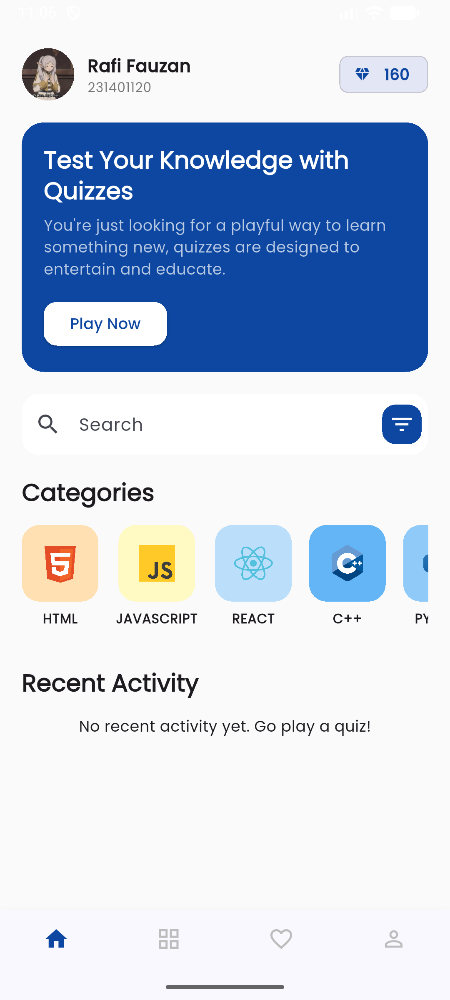
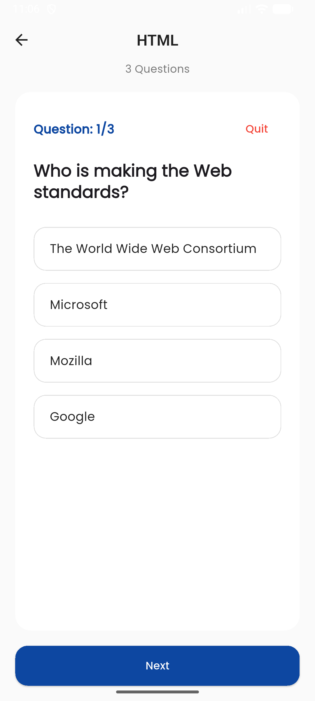
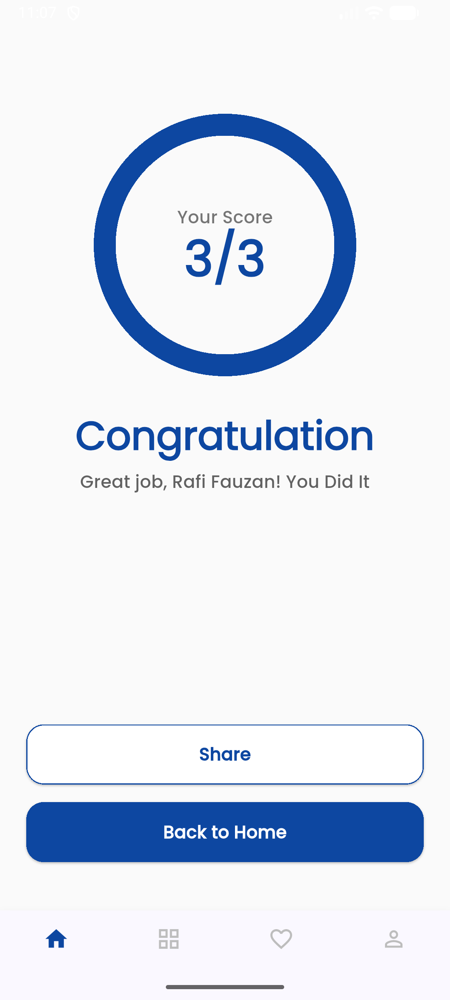

# Quiz App

## Profile

**Nama:** Rafi Fauzan Tsany Lubis
**NIM:** 231401120
**KOM:** C

## Deskripsi Aplikasi

Aplikasi Quiz App adalah sebuah aplikasi interaktif yang dirancang untuk menguji pengetahuan
pengguna melalui serangkaian pertanyaan kuis. Aplikasi ini menyediakan berbagai kategori kuis
dan tingkat kesulitan yang berbeda, memungkinkan pengguna untuk memilih sesuai minat dan
tingkat pengetahuan mereka. Dengan antarmuka yang user-friendly, pengguna dapat dengan mudah
menavigasi aplikasi, menjawab pertanyaan, dan melihat hasil kuis mereka secara real-time.

## Referensi

- [Figma Design](https://www.figma.com/design/FOs17eyIwAcRETKSE4IPQZ/Quiz-App-UI-Design--Community-?node-id=28-95&t=3mLL5oAOjmTEEuUy-1)
- [Referensi Figma](https://www.figma.com/community/file/1388742897600023965)

## Screenshot Aplikasi

